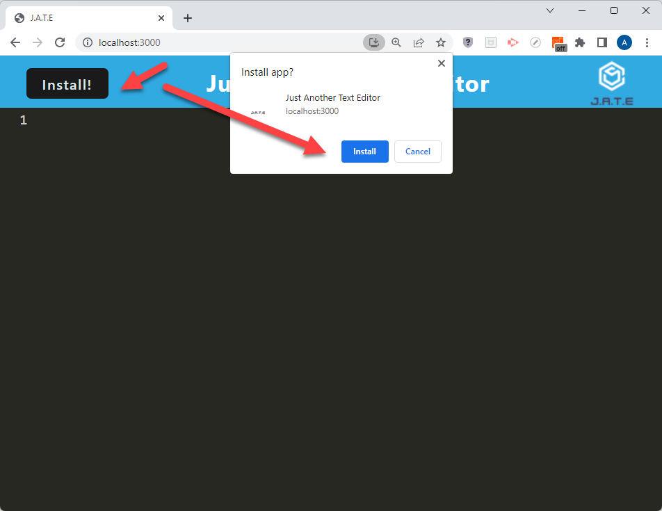
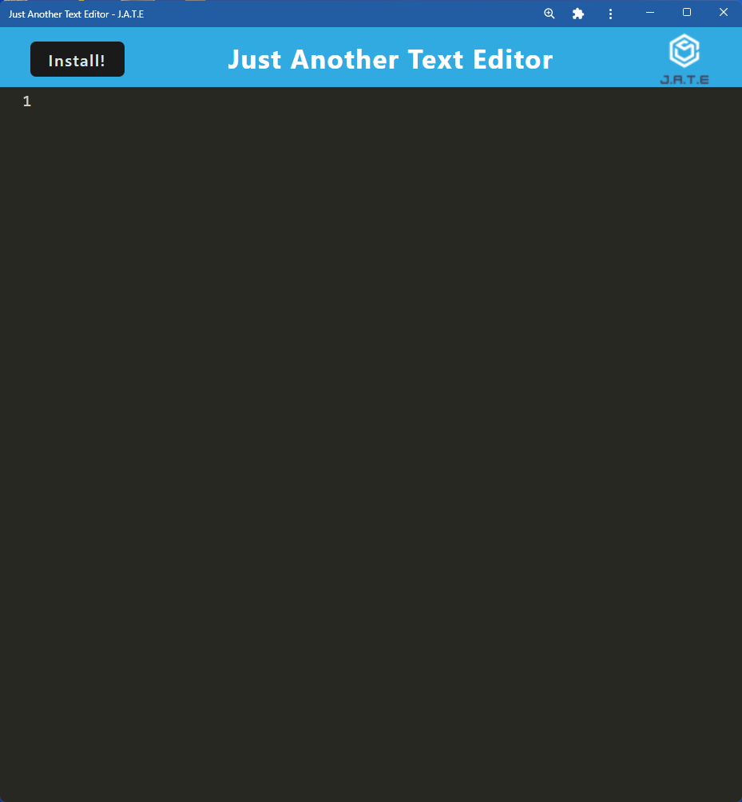
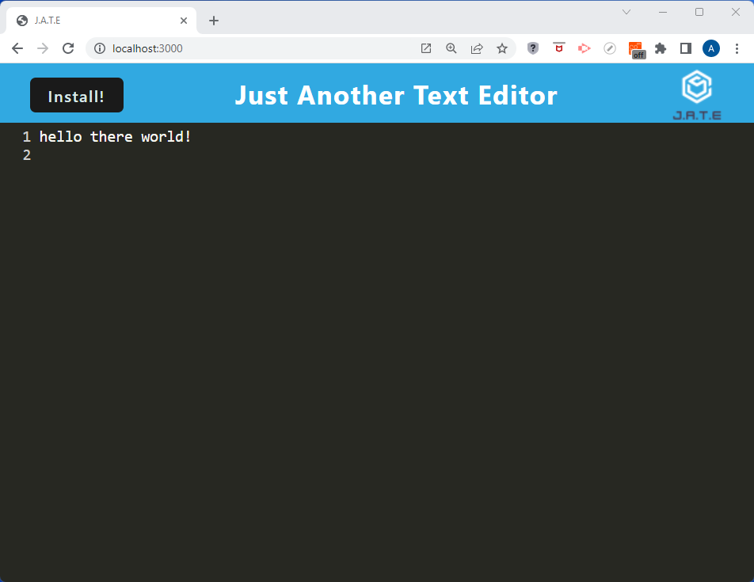
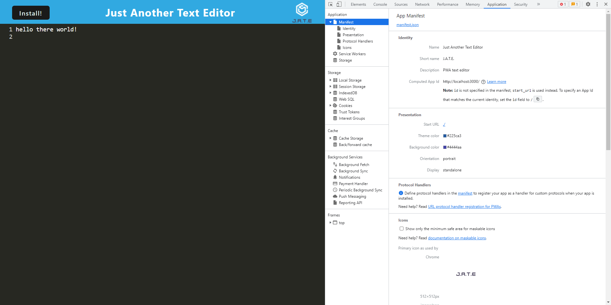
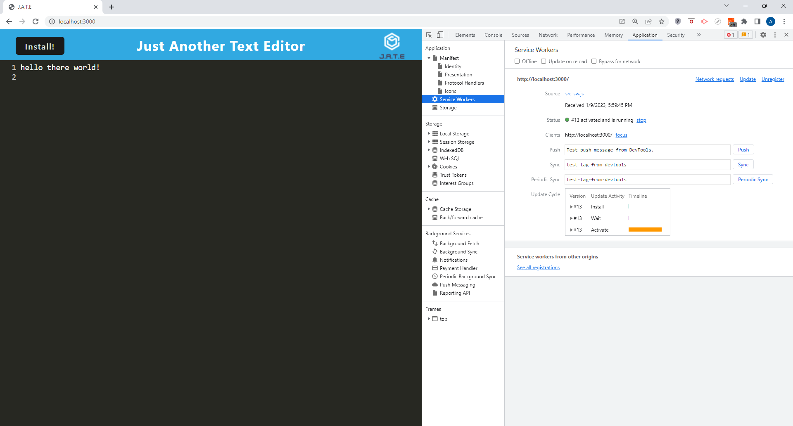
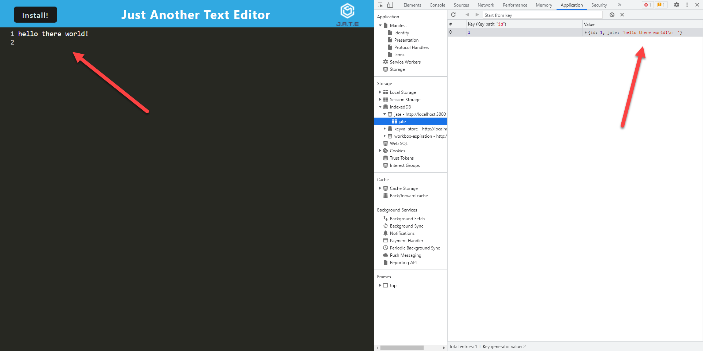

# Progressive Web Applications (PWA) Challenge: Text Editor deployed on Heroku


Deployed Link on Heroku:
https://pwa-text-editor-jate-23.herokuapp.com

## Table of Contents

- [Description](#description)
- [Installation](#installation)
- [Usage](#usage)
- [Credits](#credits)
- [License](#license)
- [Features](#features)
- [How-to-Contribute](#how-to-contribute)
- [Tests](#test-instructions)
- [Questions](#questions)

## Description
The task for this project was to build a text editor that runs in the browser. The app is a single-page application that meets the PWA criteria. Additionally, it features a number of data persistence techniques that serve as redundancy in case one of the options is not supported by the browser. The application also functions offline.

The app uses methods for getting and storing data to an IndexedDB database, using a package called idb, which is a lightweight wrapper around the IndexedDB API.

The entire application is deployed on Heroku.

**User Story**

```md
AS A developer
I WANT to create notes or code snippets with or without an internet connection
SO THAT I can reliably retrieve them for later use
```

**Acceptance Criteria**

```md
GIVEN a text editor web application
WHEN I open my application in my editor
THEN I should see a client server folder structure
WHEN I run `npm run start:dev` from the root directory
THEN I find that my application should start up the backend and serve the client
WHEN I run the text editor application from my terminal
THEN I find that my JavaScript files have been bundled using webpack
WHEN I run my webpack plugins
THEN I find that I have a generated HTML file, service worker, and a manifest file
WHEN I use next-gen JavaScript in my application
THEN I find that the text editor still functions in the browser without errors
WHEN I open the text editor
THEN I find that IndexedDB has immediately created a database storage
WHEN I enter content and subsequently click off of the DOM window
THEN I find that the content in the text editor has been saved with IndexedDB
WHEN I reopen the text editor after closing it
THEN I find that the content in the text editor has been retrieved from our IndexedDB
WHEN I click on the Install button
THEN I download my web application as an icon on my desktop
WHEN I load my web application
THEN I should have a registered service worker using workbox
WHEN I register a service worker
THEN I should have my static assets pre cached upon loading along with subsequent pages and static assets
WHEN I deploy to Heroku
THEN I should have proper build scripts for a webpack application
```

## Installation
<!-- audience is other developers -->

1. Clone this GitHub repo https://github.com/abrownstein2022/ch19-pwa-text-editor:
<!-- Check out the gh cli tool from github -->
```bash
$ gh repo clone /abrownstein2022/ch19-pwa-text-editor
```
2. From the terminal, install npm, build:

```bash
$ npm i
$ npm run build
```

<!-- [] implies user input 
 mysql> restaurant_mgr < C:\[filename].sql
-->

3. Start the local server and client concurrently:
```bash
$ npm run start:dev 
```

4. Open a browser to test any changes you make to the application after cloning.

## Usage

1. Open the app using Heroku https://pwa-text-editor-jate-23.herokuapp.com

or
1. Use the application locally as self-contained PWA by installing it before disconnecting from the internet.
1. Click the install me button in the browser to download the app.

1. CLick on the app icon to run it.

1. Use the app on your desktop the same way you would in the browser.


## Credits

```md
Alexis Brownstein
```

## License

 ```md
 MIT 
```

Link to license text:
https://opensource.org/licenses/mit-license


## Features

<!-- 
# h1
###### h6
**bold**
*italic*
_underline_

| key | value |
|-|-|
| name | 'bob' |


- list
- items

1. numberd
1. list
1. all ones - auttomatic numbering
Feattures for *future* development
 -->
**The main features in this project are:**<br>
1. Can be used via Heroku link or locally on your computer even when disconnected from the internet
1. Uses a package called idb, which is a lightweight wrapper around the IndexedDB API
1. Uses webpack plugins and a registered service worker using workbox
1. Generated an HTML file
1. Click install button to download the web application as an icon on your desktop
1. Necessary folder structure 
1. Professional README

**The screenshots below show the app features:**
1. JATE browser functionality

1. JATE manifest.json 

1. JATE service worker 

1. JATE indexed db storage


## How-to-Contribute

N/A

## Test Instructions

N/A

## Questions

Feel free to contact me with any questions.

I can be reached at alexis@drdatabase.com.

This GitHub repo can be found at:
  
https://github.com/abrownstein2022/ch19-pwa-text-editor
 
